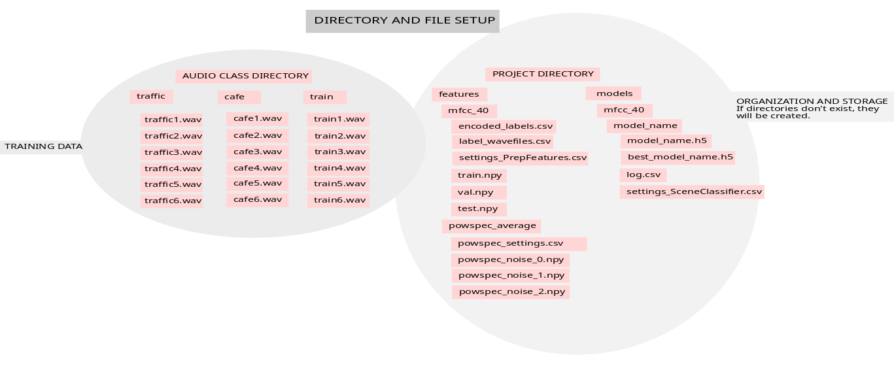
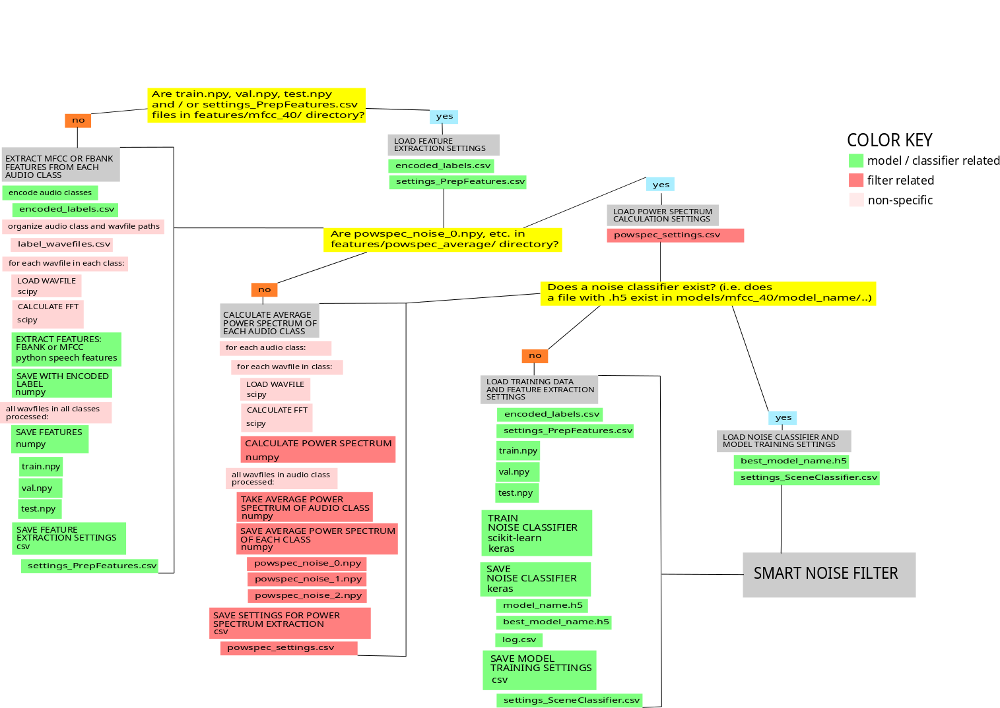
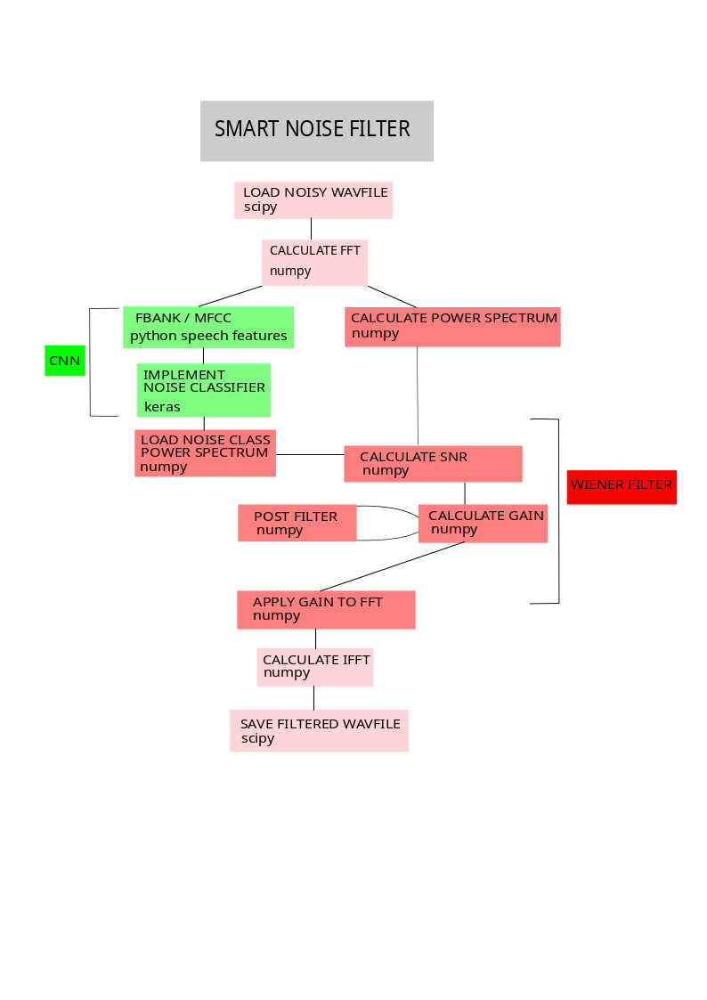

Overview
========

A Walk Through the Modules
--------------------------

Here you can read about what the package is doing. For a more hands-on experience, please refer to this demo_.

.. _demo: https://notebooks.ai/a-n-rose/noize-demo-360a3df2

1) Running the smart filter module
----------------------------------

Relevant submodule:

    noize.buildsmartfilter.my_smartfilter

In the main module, you will see how the program completes the steps we will walk through below. It imports the modules relevant to complete each step, and continues once the data necessary for each step has been collected.

2) File Setup
-------------

relevant submodule:

    noize.file_architecture.paths
    
The program expects the following architecture (I'm sorry, you might need to zoom in).

Figure 1: Smart Filter File Architecture
----------------------------------------

Therefore, before the program does anything with sound, it first checks for the existence of such paths and files. It seeks to find out whether or not it should extract features and train a model. The files it searches for indicate:

- if audio data for training exists, and if so, where they are located
- if model training features (i.e. mfcc, fbank) have been extracted, and if so, where they are located
- if filter features (i.e. audio class acoustic profiles or Welch's method) have been extracted, and if so, where they are located
- if a model (i.e. scene classifier) has been trained, and if so, where it is located

Figure 2: Smart Filter Setup
----------------------------

3) Features for model training 
------------------------------

Relevant submodules:

    noize.acousticfeats_ml.featorg
    
    noize.acousticfeats_ml.modelfeats

The program checks for the existence of datasets (i.e. train.npy, val.npy, test.npy), for how the audio classes were encoded (i.e. encoded_labels.csv), and for the settings of that specific feature extraction session (i.e. settings_PrepFeatures.csv).

If audio data is present and no dataset files are found, features for model training are extracted.

4) Features for noise filtering 
-------------------------------

Relevant submodule:

    noize.filterfun.filters.get_average_power

The program checks for the existence of average power spectrum data for each audio class found in the provided audio dataset (e.g. powspec_noise_0.npy, powspec_noise_1.npy, powspec_noise_2.npy) as well as the settings associated with that feature extraction session (i.e. powspec_settings.csv).

If audio data is present and no average power spectrum files are found, such data is collected from each audio class from the provided dataset.

5) Build or load a model
------------------------

Relevant submodules:

    noize.models.cnn.buildclassifier 

    noize.models.cnn.loadclassifier

If a model already exists, only the settings_PrepFeatures.csv file is necessary; otherwise the train.npy, val.npy and test.npy files as well as the settings_PrepFeatures.csv file will be used to train a new model.

6) Real-world data: Classify new audio
--------------------------------------

Relevant submodule:

    noize.models.cnn.ClassifySound

One second of sound will be analyzed from the file to be filtered. That section will be classified, by the previously trained model, according to its acoustic profile (i.e. power spectrum) and assigned the audio class that is most similar.

7) Real-world data: Filter out classified noise
-----------------------------------------------

Relevant submodule:

    noize.filterfun.applyfilter

The Wiener Filter is then applied to remove that noise class's acoustic profile. The filtered wavfile is then saved. 

Figure 3: Smart Filter Flow Chart
---------------------------------

Installation
============

Installation and running of this package can be interactively explored in this Jupyter notebook_. There you can look at the file architecture this package creates, and how new directories can be created for new datasets or different types of features extracted, etc.  

.. _notebook: https://notebooks.ai/a-n-rose/noize-demo-360a3df2

